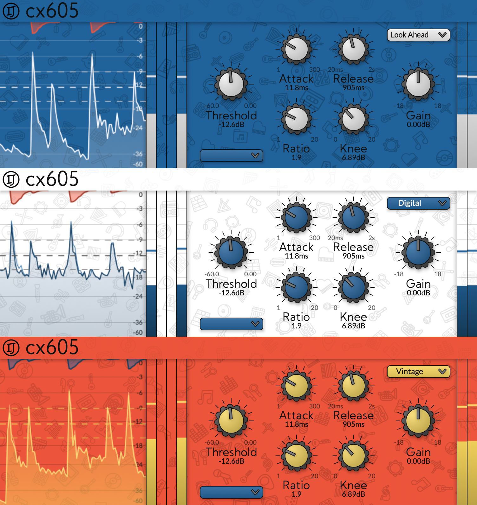
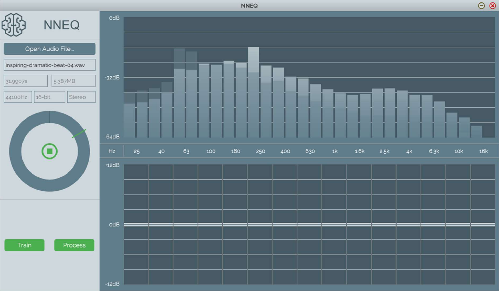
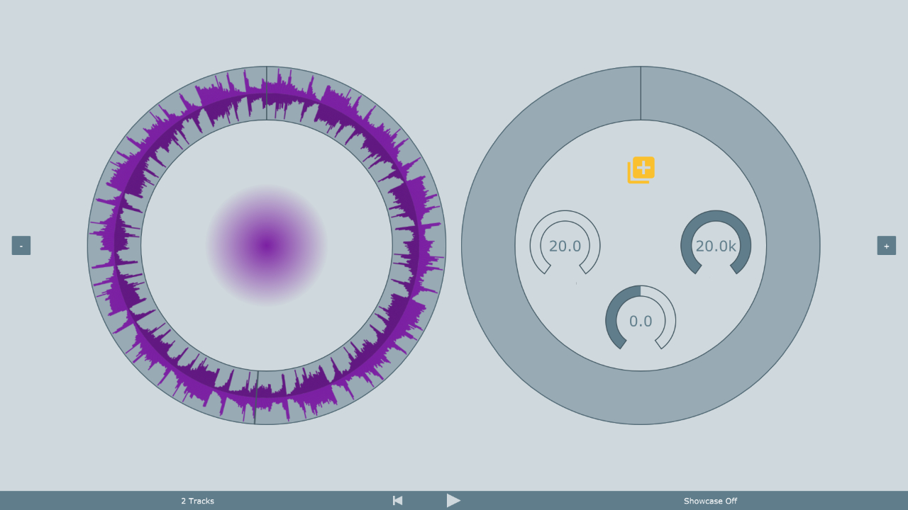

# Stuff I'm working on

## JIVE

<em>Author 2021-Present</em>

A bundle of JUCE modules that completely overhaul the frontend development experience using concepts from popular web frontend frameworks like React.

    

## Gramotech

<em>Lead Developer, Designer 2018 - Present</em>

Released four commercial audio plugins amassing over 20,000 active users.

Babylon (2018) - comprehensive multi-band EQ, featured in the <a href="https://www.soundonsound.com/reviews/gramotech-audio-babylon-eq">February 2019 edition of Sound on Sound</a>.

Pompeii (2018) - multi-band dynamics processor.

GT Analyser (2019) - free spectrum analyser plugin, described as <em>"the most beautiful analyzer I've ever seen"</em> by <a href="https://www.reddit.com/r/audioengineering/comments/nri3e0/gramotech_spectrum_analyzer_is_the_most_beautiful/">some guy on reddit</a>.

Contortion-24 (2020) - distortion and saturation plugin, featuring <em>"A WEIRD DEMO"</em> according to <a href="https://www.youtube.com/watch?v=cqasun5nzmA">some guy on YouTube</a>. He was right tbf.

             

## Focusrite Control 2

<em>Developer, General Nuisance 2023 - Present</em>

Focusrite's revamped control software for the 4th generation Scarlett range of audio interfaces.

          

# Stuff I've worked on previously

## Contrast

<em>Author 2020 - 2022</em>

Bundle of audio plugins mostly built using the stock DSP tools provided by JUCE.

I may come back to this in the future, but no immediate plans.

      

## cx605

<em>Developer, Designer 2020</em>

An open-source compressor plugin I started working on but never finished. The idea was to have three different "characters" - Digital, which would aim to keep the signal as clean as possible, Vintage, which would apply saturation, and Look-Ahead, which is self-explainatory.

           

## Vocaster Hub

<em>Developer 2021 - 2022</em>

Control software for Focusrite's new Vocaster range of audio interfaces targetted at Podcasters.

            

## Red Plug-In Suite 2

<a href="https://focusrite.com/software/red-plugin-suite"><a/>

<em>Lead Developer 2022 - 2023</em>

Migrated Focusrite's most widely used plugin bundle, the Red 2 EQ and Red 3 Compressor, from iPlug over to JUCE to add Apple Silicon support.

          

## University of the West of England

<em>Student 2014 - 2017</em>

Various interesting projects during my time studying Audio and Music Technology at <a href="https://www.uwe.ac.uk/">UWE</a>. Most notably a neural-network-enhanced EQ application, NNEQ (top), and Elliptical, a looping audio player with fun visuals (bottom).

                   

## JUCE

<em>Listed contributor, regular forum contributor 2017-Present</em>

Proud author of a commit that added an `= 0` default argument to a function hardly anyone uses, thus earning myself bragging rights as an official JUCE contributor.

  

## Alliance of Numpties

<em>Co-founder, the good-looking one 1996 - Present</em>

Occasionally dabble in game development with my older little brother and fellow Numpty, <a href="https://github.com/ollij93">@ollij93</a>.

Most recently winning the <a href="https://itch.io/jam/mini-jame-gam-37/results">Mini Jame Gam 37</a> with our game, <a href="https://ollij93.itch.io/agent-of-dream">Agent of D.Re.AM</a>, and previously placing 3rd out of 60 in the <a href="https://itch.io/jam/mini-jame-gam-24">Mini Jame Gam 24</a> with our game, <a href="https://itch.io/jam/mini-jame-gam-24/rate/2386890">Terry Toastington</a>.

    
